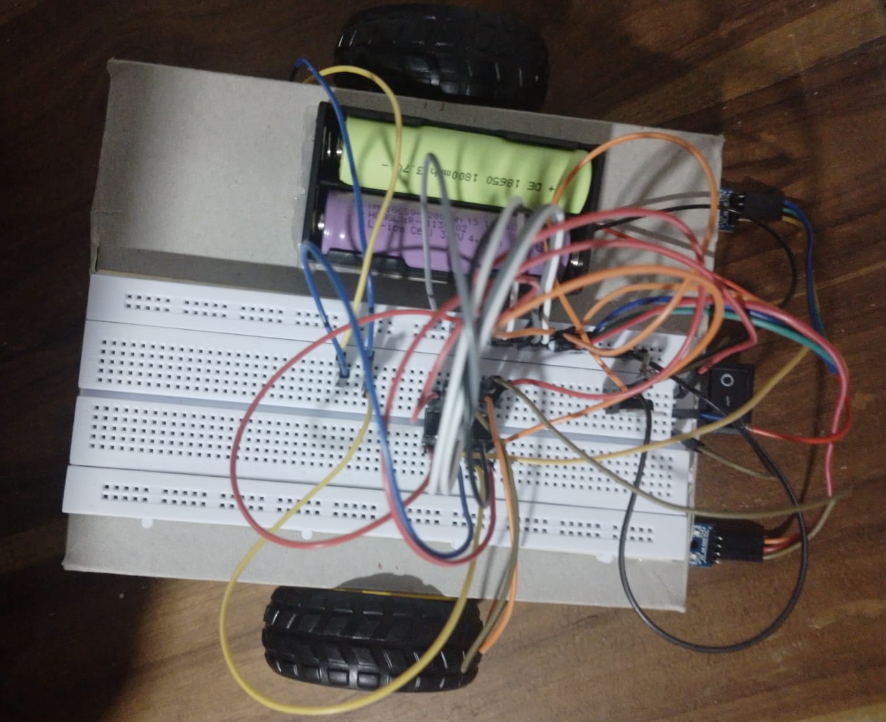
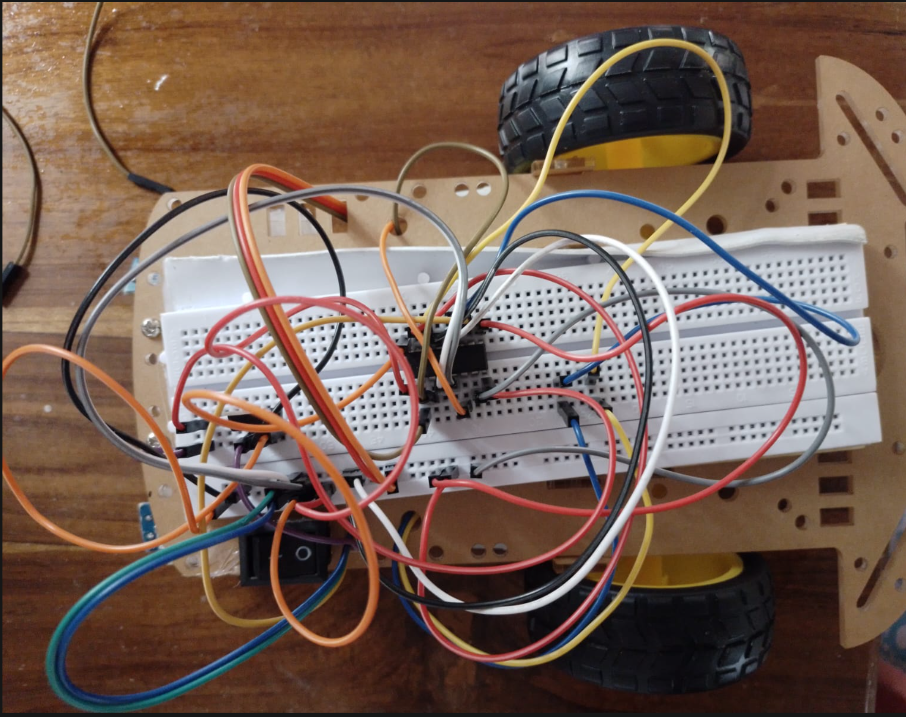

# Pure-Analog-Line-Follower-Robot
Pure analog line follower robot using TCRT5000 sensors, LM358 comparator, and L293D motor driver. This project documents the complete engineering journey, including hardware troubleshooting, power management, and design improvements.
## Version History

| Version | Improvement |
|--------|-------------|
| V1 | Basic Sensor Setup |
| V2 | Added LM7805 |
| V3 | Removed Capacitors |
| V4 | Corrected Sensor Logic |
| V5 | Reconfigured Motor Pins |
| V6 | Added LM358 + Potentiometer |
| V7 | Added 2S BMS |

## Components

| Component | Quantity |
|----------|---------|
| TCRT5000 | 2 |
| LM358P | 1 |
| L293D | 1 |
| LM7805 | 1 |
| Potentiometer | 1 |
| 2S BMS | 1 |
| 7.4V Battery | 1 |
| DC Motors | 2 |
## L293D Motor Driver Connections

| L293D Pin | Connection |
|----------|------------|
| Pin 1 (EN1) | +5V |
| Pin 2 (IN1) | LM358 Pin 1 |
| Pin 3 (OUT1) | Left Motor Terminal 1 |
| Pin 4 | GND |
| Pin 5 | GND |
| Pin 6 (OUT2) | Left Motor Terminal 2 |
| Pin 7 (IN2) | GND (or +5V for fixed direction) |
| Pin 8 (VCC2) | 7.4V Battery (+) |
| Pin 9 (EN2) | +5V |
| Pin 10 (IN3) | LM358 Pin 7 |
| Pin 11 (OUT3) | Right Motor Terminal 1 |
| Pin 12 | GND |
| Pin 13 | GND |
| Pin 14 (OUT4) | Right Motor Terminal 2 |
| Pin 15 (IN4) | GND (or +5V for fixed direction) |
| Pin 16 (VCC1) | +5V |

---

## LM358 Connections

| LM358 Pin | Connection |
|----------|------------|
| Pin 1 | L293D Pin 2 |
| Pin 2 | Potentiometer Output (Reference) |
| Pin 3 | Left TCRT5000 Output |
| Pin 4 | GND |
| Pin 5 | Right TCRT5000 Output |
| Pin 6 | Potentiometer Output (Reference) |
| Pin 7 | L293D Pin 10 |
| Pin 8 | +5V |

---

## Potentiometer Connections

| Potentiometer Pin | Connection |
|------------------|------------|
| Pin 1 | +5V |
| Pin 2 (Middle) | LM358 Pins 2 & 6 |
| Pin 3 | GND |

---

## TCRT5000 Sensor Connections

| Sensor Pin | Connection |
|-----------|------------|
| Left Sensor VCC | +5V |
| Left Sensor GND | GND |
| Left Sensor OUT | LM358 Pin 3 |
| Right Sensor VCC | +5V |
| Right Sensor GND | GND |
| Right Sensor OUT | LM358 Pin 5 |

---

## Power Connections

| Component | Connection |
|----------|------------|
| Battery (+) | BMS B+ |
| Battery Junction | BMS BM |
| Battery (-) | BMS B- |
| BMS P+ | LM7805 IN & L293D Pin 8 |
| BMS P- | Common Ground |
| LM7805 OUT | +5V Rail |

---

## Hardware Architecture

```text
TCRT5000 Sensors
        ↓
      LM358
        ↓
      L293D
        ↓
     DC Motors
```
## Engineering Challenges

| Issue | Solution |
|------|----------|
| Motors too fast | Reduced motor voltage |
| Capacitor issue | Removed faulty capacitors |
| Wrong sensor logic | Inverted LM358 inputs |
| Battery failure | Added 2S BMS |

## Lessons Learned

- Hardware debugging requires patience.
- Power management is critical.
- Small wiring changes significantly affect behavior.
- Battery protection should never be ignored.
- Documentation is an essential engineering skill.

<h2>Development Progress</h2>

<table>
  <tr>
    <th>Initial Prototype</th>
    <th>Final Prototype</th>
  </tr>
  <tr>
    <td></td>
    <td></td>
  </tr>
</table>
